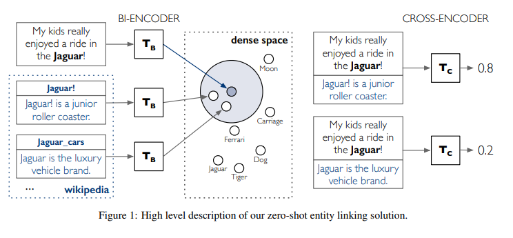

### BLINK
BLINK is an Entity Linking model released by Facebook that uses Wikipedia as the target knowledge base. The process of linking entities to Wikipedia is also known as [Wikification](https://en.wikipedia.org/wiki/Wikification).

In a nutshell, BLINK uses a two stages approach for entity linking, based on fine-tuned BERT architectures. In the first stage, BLINK performs retrieval in a dense space defined by a bi-encoder that independently embeds the mention context and the entity descriptions. Each candidate is then examined more carefully with a cross-encoder, that concatenates the mention and entity text. BLINK achieves state-of-the-art results on multiple datasets.

The BLINK knowledge base (entity library) is based on the 2019/08/01 Wikipedia dump, so the target entities are Wikipedia entities or articles. 

- [Paper](https://arxiv.org/pdf/1911.03814.pdf)
- [Original Source Code](https://github.com/facebookresearch/BLINK)

::: zshot.linker.LinkerBlink