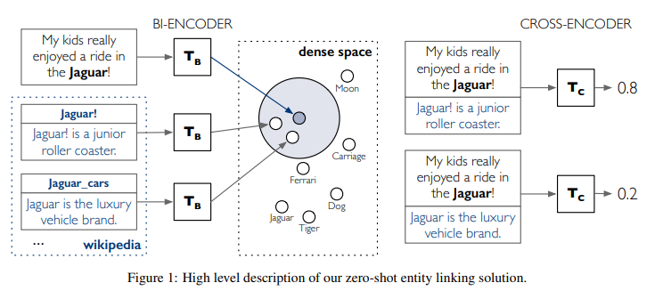

# Linker

The **linker** will link the detected entities to a existing set of labels. Some of the **linkers**, however, are *end-to-end*, i.e. they don't need the **mentions extractor**, as they detect and link the entities at the same time.  

Again, there are 4 **linkers** available currently, 2 of them are *end-to-end* and 2 are not. Let's start with those thar are not *end-to-end*:

### BLINK
BLINK is an Entity Linking model released by Facebook that uses Wikipedia as the target knowledge base. The process of linking entities to Wikipedia is also known as [Wikification](https://en.wikipedia.org/wiki/Wikification).

In a nutshell, BLINK uses a two stages approach for entity linking, based on fine-tuned BERT architectures. In the first stage, BLINK performs retrieval in a dense space defined by a bi-encoder that independently embeds the mention context and the entity descriptions. Each candidate is then examined more carefully with a cross-encoder, that concatenates the mention and entity text. BLINK achieves state-of-the-art results on multiple datasets.

The BLINK knowledge base (entity library) is based on the 2019/08/01 Wikipedia dump, so the target entities are Wikipedia entities or articles. 

- [Paper](https://arxiv.org/pdf/1911.03814.pdf)
- [Original Source Code](https://github.com/facebookresearch/BLINK)

### GENRE
GENRE is also an entity linking model released by Facebook, but in this case it uses a different approach by conseidering the NERC task as a sequence-to-sequence problem, and retrieves the entities by using a constrained beam search to force the model to generate the entities.

In a nutshell, (m)GENRE uses a sequence-to-sequence approach to entity retrieval (e.g., linking), based on fine-tuned [BART](https://arxiv.org/abs/1910.13461). GENRE performs retrieval generating the unique entity name conditioned on the input text using constrained beam search to only generate valid identifiers.
Although there is a version *end-to-end* of GENRE, it is not currently supported on ZShot (but it will). 

- [Paper](https://arxiv.org/pdf/2010.00904.pdf)
- [Original Source Code](https://github.com/facebookresearch/GENRE)

### SMXM
When there is no labelled data (i.e.: Zero-Shot approaches) the performance usually decreases due to the fact that the model doesn't really know what does the entity represent. To address this problem the SMXM model uses the description of the entities to give the model information about the entities.

By using the descriptions, the SMXM model is able to understand the entity. Although this approach is Zero-Shot, as it doesn't need to have seen the entities during training, the user still have to specify the descriptions of the entities.

This is an *end-to-end* model, so there is no need to use a **mentions extractor** before.

- [Paper](https://aclanthology.org/2021.acl-long.120/)
- [Original Source Code](https://github.com/Raldir/Zero-shot-NERC)

### TARS
Task-aware representation of sentences (TARS), is a simple and effective method for few-shot and even zero-shot learning for text classification. However, it was extended to perform Zero-Shot NERC. 

Basically, TARS tries to convert the problem to a binary classification problem, predicting if a given text belongs to a specific class.

TARS doesn't need the descriptions of the entities, so if you can't provide the descriptions of the entities maybe this is the approach you're looking for.

- [Paper](https://kishaloyhalder.github.io/pdfs/tars_coling2020.pdf)
- [Original Source Code](https://github.com/flairNLP/flair)

::: zshot.Linker