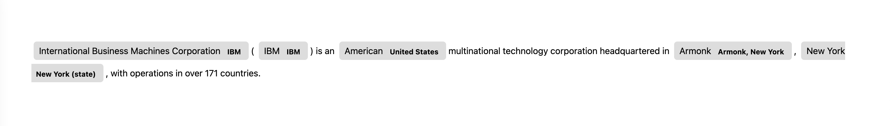

<div align="center">
  

  <h1>Zshot</h1>

  <p>
    <strong>Zero and Few shot named entity & relationships recognition</strong>
  </p>

  <p>

<a href="https://travis.ibm.com/Dublin-Research-Lab/zshot.svg?token=zSP5krJq4ryG4zqgNyms&branch=master"> </a>
    <a href="https://pages.github.ibm.com/Dublin-Research-Lab/zshot/"> </a>
  </p>
</div>

**Documentation**: <a href="https://pages.github.ibm.com/Dublin-Research-Lab/zshot" target="_blank">https://pages.github.ibm.com/Dublin-Research-Lab/zshot</a>

**Source Code**: <a href="https://github.ibm.com/Dublin-Research-Lab/zshot" target="_blank">https://github.ibm.com/Dublin-Research-Lab/zshot</a>


Zshot is a highly customisable framework for performing Zero and Few shot named entity recognition.

Can be used to perform:

- **Mentions extraction**: Identify globally relevant mentions or mentions relevant for a given domain 
- **Wikification**: The task of linking textual mentions to entities in Wikipedia
- **Zero and Few Shot named entity recognition**: using language description perform NER to generalize to unseen domains (work in progress)
- **Zero and Few Shot named relationship recognition** (work in progress)

## Requirements

* `Python 3.6+`

* <a href="https://spacy.io/" target="_blank"><code>spacy</code></a> - Zshot rely on <a href="https://spacy.io/" class="external-link" target="_blank">Spacy</a> for pipelining and visualization
* <a href="https://pytorch.org/get-started" target="_blank"><code>torch</code></a> - PyTorch is required to run pytorch models.
* <a href="https://huggingface.co/docs/transformers/index" target="_blank"><code>transformers</code></a> - Required for pre-trained language models.
* <a href="https://huggingface.co/docs/evaluate/index" target="_blank"><code>evaluate</code></a> - Required for evaluation.
* <a href="https://huggingface.co/docs/datasets/index" target="_blank"><code>datasets</code></a> - Required to evaluate over datasets (e.g.: OntoNotes).

## Optional Dependencies

* <a href="https://github.com/flairNLP/flair" target="_blank"><code>flair</code></a> - Required if you want to use Flair mentions extractor and for TARS linker.
* <a href="https://github.com/facebookresearch/BLINK" target="_blank"><code>blink</code></a> - Required if you want to use Blink for linking to Wikipedia pages.


## Installation

<div class="termy">

```console
$ pip install -r requirements.txt

---> 100%
```

</div>

### Install additional dependencies

Install the [transfomers](https://huggingface.co/docs/transformers/index) library to use pre-trained models

```console
$ pip install transformers

---> 100%
```


## Example: Zero-Shot Entity Recognition

### How to use it

* Create a file `main.py` with:

```Python
import spacy
from zshot import PipelineConfig, displacy
from zshot.linker import LinkerRegen
from zshot.mentions_extractor import MentionsExtractorSpacy
from zshot.utils.data_models import Entity

nlp = spacy.load("en_core_web_sm")
nlp_config = PipelineConfig(
    mentions_extractor=MentionsExtractorSpacy(),
    linker=LinkerRegen(),
    entities=[
        Entity(name="Paris",
               description="Paris is located in northern central France, in a north-bending arc of the river Seine"),
        Entity(name="IBM",
               description="International Business Machines Corporation (IBM) is an American multinational technology corporation headquartered in Armonk, New York"),
        Entity(name="New York", description="New York is a city in U.S. state"),
        Entity(name="Florida", description="southeasternmost U.S. state"),
        Entity(name="American",
               description="American, something of, from, or related to the United States of America, commonly known as the United States or America"),
        Entity(name="Chemical formula",
               description="In chemistry, a chemical formula is a way of presenting information about the chemical proportions of atoms that constitute a particular chemical compound or molecule"),
        Entity(name="Acetamide",
               description="Acetamide (systematic name: ethanamide) is an organic compound with the formula CH3CONH2. It is the simplest amide derived from acetic acid. It finds some use as a plasticizer and as an industrial solvent."),
        Entity(name="Armonk",
               description="Armonk is a hamlet and census-designated place (CDP) in the town of North Castle, located in Westchester County, New York, United States."),
        Entity(name="Acetic Acid",
               description="Acetic acid, systematically named ethanoic acid, is an acidic, colourless liquid and organic compound with the chemical formula CH3COOH"),
        Entity(name="Industrial solvent",
               description="Acetamide (systematic name: ethanamide) is an organic compound with the formula CH3CONH2. It is the simplest amide derived from acetic acid. It finds some use as a plasticizer and as an industrial solvent."),
    ]
)
nlp.add_pipe("zshot", config=nlp_config, last=True)

text = "International Business Machines Corporation (IBM) is an American multinational technology corporation" \
       " headquartered in Armonk, New York, with operations in over 171 countries."

doc = nlp(text)
displacy.serve(doc, style="ent")
```


### Run it

Run with

```console
$ python main.py

Using the 'ent' visualizer
Serving on http://0.0.0.0:5000 ...
```


The script will annotate the text using Zshot and use Displacy for visualising the annotations

### Check it

Open your browser at <a href="http://127.0.0.1:5000" class="external-link" target="_blank">http://127.0.0.1:5000</a> .

You will see the annotated sentence:



### How to create a custom component

If you want to implement your own mentions_extractor or linker and use it with ZShot you can do it. To make it easier for the user to implement a new component, some base classes are provided that you have to extend with your code.

It is as simple as create a new class extending the base class (`MentionsExtractor` or `Linker`). You will have to implement the predict method, which will receive the SpaCy Documents and will return a list of `zshot.utils.data_models.Span` for each document.

This is a simple mentions_extractor that will extract as mentions all words that contain the letter s:

```python
from typing import Iterable
import spacy
from spacy.tokens import Doc
from zshot import PipelineConfig
from zshot.utils.data_models import Span
from zshot.mentions_extractor import MentionsExtractor

class SimpleMentionExtractor(MentionsExtractor):
    def predict(self, docs: Iterable[Doc], batch_size=None):
        spans = [[Span(tok.idx, tok.idx + len(tok)) for tok in doc if "s" in tok.text] for doc in docs]
        return spans

new_nlp = spacy.load("en_core_web_sm")

config = PipelineConfig(
    mentions_extractor=SimpleMentionExtractor()
)
new_nlp.add_pipe("zshot", config=config, last=True)
text_acetamide = "CH2O2 is a chemical compound similar to Acetamide used in International Business " \
        "Machines Corporation (IBM)."

doc = new_nlp(text_acetamide)
print(doc._.mentions)

>>> [is, similar, used, Business, Machines, materials]
```

### How to evaluate ZShot

Evaluation is an important process to keep improving the performance of the models, that's why ZShot allows to evaluate the component with two predefined datasets: OntoNotes and MedMentions, in a Zero-Shot version in which the entities of the test and validation splits don't appear in the train set.  

The package `evaluation` contains all the functionalities to evaluate the ZShot components. The main function is `zshot.evaluation.zshot_evaluate.evaluate`, that will take as input the SpaCy `nlp` model and the dataset(s) and split(s) to evaluate. It will return a `str` containing a table with the results of the evaluation. For instance the evaluation of the ZShot custom component implemented above would be:

```python
from zshot.evaluation.zshot_evaluate import evaluate
from datasets import Split

evaluation = evaluate(new_nlp, datasets="ontonotes", 
                      splits=[Split.VALIDATION])
print(evaluation)
```
