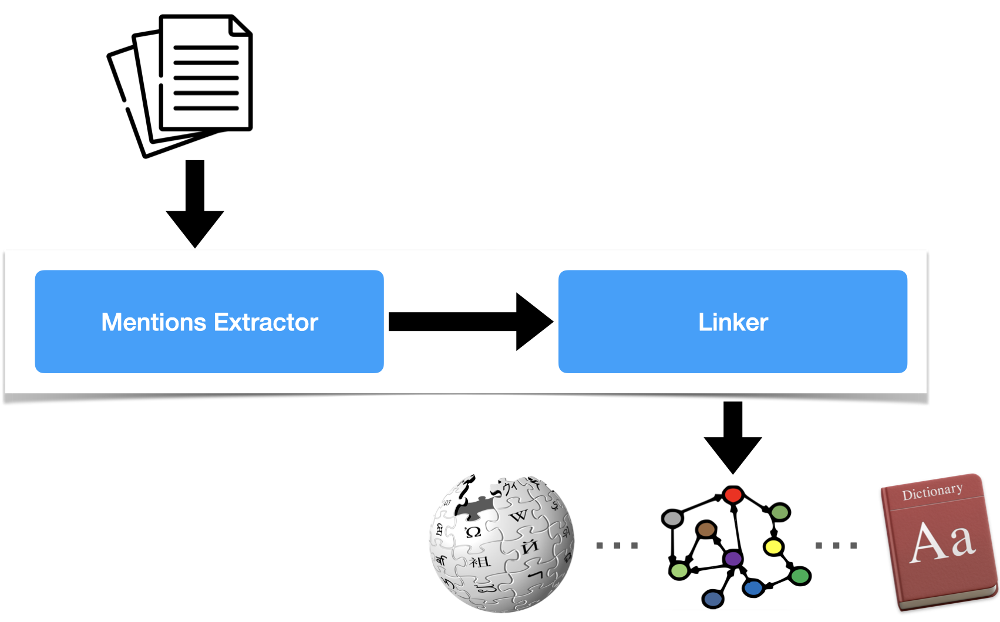

# Zshot

<p align="center">
  <a href="https://fastapi.tiangolo.com"></a>
</p>
<p align="center">
    <em>Zero and Few shot Named Entities and Relationships recognition</em>
</p>
<p align="center">
<a href="https://travis.ibm.com/Dublin-Research-Lab/zshot" target="_blank">
    
</a>
</p>

---

**Documentation**: <a href="https://pages.github.ibm.com/Dublin-Research-Lab/zshot" target="_blank">https://pages.github.ibm.com/Dublin-Research-Lab/zshot</a>

**Source Code**: <a href="https://github.ibm.com/Dublin-Research-Lab/zshot" target="_blank">https://github.ibm.com/Dublin-Research-Lab/zshot</a>

---

Zshot is a highly customasible framework for performing Zero and Few shot named entity recognition.

Can be used to perform:

- **Mentions extraction**: Identify globally relevant mentions or mentions relevant for a given domain 
- **Wikification**: The task of linking textual mentions to entities in Wikipedia
- **Zero and Few Shot named entity recognition**: using language description perform NER to generalize to unseen domains (work in progress)
- **Zero and Few Shot named relationship recognition** (work in progress)

## Requirements

* Python 3.6+

* Zshot rely on <a href="https://spacy.io/" class="external-link" target="_blank">Spacy</a> for pipelining and visualization:

## Installation

<div class="termy">

```console
$ pip install -r requirements.txt

---> 100%
```

</div>

## Example: Zero-Shot Entity Recognition

### Install additional dependencies

Install the [transfomers](https://huggingface.co/docs/transformers/index) library to use pre-trained models

```console
$ pip install transformers

---> 100%
```

### Example of use

* Create a file `main.py` with:

```Python
from zshot import PipelineConfig, displacy
from zshot.linker import LinkerRegen
from zshot.mentions_extractor import MentionsExtractorSpacy
from zshot.utils.data_models import Entity

nlp = spacy.load("en_core_web_sm")
nlp_config = PipelineConfig(
    mentions_extractor=MentionsExtractorSpacy(),
    linker=LinkerRegen(),
    entities=[
        Entity(name="Paris",
               description="Paris is located in northern central France, in a north-bending arc of the river Seine"),
        Entity(name="IBM",
               description="International Business Machines Corporation (IBM) is an American multinational technology corporation headquartered in Armonk, New York"),
        Entity(name="New York", description="New York is a city in U.S. state"),
        Entity(name="Florida", description="southeasternmost U.S. state"),
        Entity(name="American",
               description="American, something of, from, or related to the United States of America, commonly known as the United States or America"),
        Entity(name="Chemical formula",
               description="In chemistry, a chemical formula is a way of presenting information about the chemical proportions of atoms that constitute a particular chemical compound or molecule"),
        Entity(name="Acetamide",
               description="Acetamide (systematic name: ethanamide) is an organic compound with the formula CH3CONH2. It is the simplest amide derived from acetic acid. It finds some use as a plasticizer and as an industrial solvent."),
        Entity(name="Armonk",
               description="Armonk is a hamlet and census-designated place (CDP) in the town of North Castle, located in Westchester County, New York, United States."),
        Entity(name="Acetic Acid",
               description="Acetic acid, systematically named ethanoic acid, is an acidic, colourless liquid and organic compound with the chemical formula CH3COOH"),
        Entity(name="Industrial solvent",
               description="Acetamide (systematic name: ethanamide) is an organic compound with the formula CH3CONH2. It is the simplest amide derived from acetic acid. It finds some use as a plasticizer and as an industrial solvent."),
    ]
)
nlp.add_pipe("zshot", config=nlp_config, last=True)

text = "International Business Machines Corporation (IBM) is an American multinational technology corporation" \
       " headquartered in Armonk, New York, with operations in over 171 countries."

doc = nlp(text)
displacy.serve(doc, style="ent")
```


### Run it

Run with

```console
$ python main.py

Using the 'ent' visualizer
Serving on http://0.0.0.0:5000 ...
```


The script will annotate the text using Zshot and use Displacy for visualising the annotations

### Check it

Open your browser at <a href="http://127.0.0.1:5000" class="external-link" target="_blank">http://127.0.0.1:5000</a>.

You will see the annotated sentence:


## Optional Dependencies

* <a href="https://pytorch.org/get-started" target="_blank"><code>PyTorch</code></a> - Required to run pytorch models.
* <a href="https://huggingface.co/transformers" target="_blank"><code>transformers</code></a> - Required if you want to use pre-trained models.

Mentions extraction:

* <a href="https://github.com/flairNLP/flair" target="_blank"><code>Flair</code></a> - Required if you want to use Flair mentions extractor.

Entity linking:

* <a href="https://github.com/facebookresearch/BLINK" target="_blank"><code>Blink</code></a> - Required if you want to use Blink for linking to Wikipedia pages.